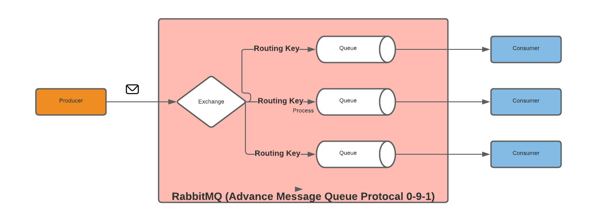

## SpringBoot with RabbitMQ.

RabbitMQ most popular Open Source message brokers. RabbitMQ is used worldwide at small startups and large enterprises

* RabbitMQ is a message broker that implements Advanced Message Queuing Protocol (AMQP)
* RabbitMQ is lightweight and easy to deploy on premises and in the cloud. It supports multiple messaging protocols.


Exchange types
* Default
* Direct
* Fanout
* Topic
* Headers

application.yml to add this configuration

```yaml
spring:
  rabbitmq:
    host: localhost
    port: 5672
    username: rabbitmq
    password: rabbitmq

rabbitmq:
  enabled: true
  queueName: devglan.queue
  exchangeName: devglan.exchange
  routingKey: devglan.routingkey
```
docker-compose file to run the RabbitMQ in docker container.

```yaml
version: '3'
services:
  rabbitmq-server:
    image: rabbitmq
    hostname: localhost
    volumes:
      - ./.docker/rabbitmq/etc/:/etc/rabbitmq/
      - ./.docker/rabbitmq/data/:/var/lib/rabbitmq/
      - ./.docker/rabbitmq/logs/:/var/log/rabbitmq/
    environment:
      #RABBITMQ_ERLANG_COOKIE: "SWQOKODSQALRPCLNMEQG"
      RABBITMQ_DEFAULT_USER: "rabbitmq"
      RABBITMQ_DEFAULT_PASS: "rabbitmq"
    ports:
      - "5672:5672"
      - "15672:15672"
    networks:
      - spring-boot-profile-network
networks:
  spring-boot-profile-network:
    driver: bridge
```

RabbitMQ Configuration 
```java
@Configuration
@Slf4j
public class RabbitMQConfig {

    private final RabbitMQProperties rabbitMQProperties;

    @Autowired
    public RabbitMQConfig(RabbitMQProperties rabbitMQProperties) {
        this.rabbitMQProperties = rabbitMQProperties;
    }

    @Bean
    public Queue queue() {
        return new Queue(rabbitMQProperties.getQueueName());
    }

    @Bean
    public TopicExchange topicExchange() {
        return new TopicExchange(rabbitMQProperties.getExchangeName());
    }

    @Bean
    public Binding binding() {
        return BindingBuilder.bind(queue()).to(topicExchange()).with(rabbitMQProperties.getRoutingKey());
    }

    @Bean
    public MessageConverter jsonMessageConverter() {
        return new Jackson2JsonMessageConverter();
    }

    @Bean
    public RabbitTemplate rabbitTemplate(ConnectionFactory connectionFactory) {
        log.info("ConnectionFactory : {} ", connectionFactory);
        final RabbitTemplate rabbitTemplate = new RabbitTemplate(connectionFactory);
        rabbitTemplate.setMessageConverter(jsonMessageConverter());
        return rabbitTemplate;
    }

    @Bean
    public SimpleMessageListenerContainer container(ConnectionFactory connectionFactory, MessageListenerAdapter messageListenerAdapter) {
        SimpleMessageListenerContainer container = new SimpleMessageListenerContainer();
        container.setConnectionFactory(connectionFactory);
        container.addQueueNames(rabbitMQProperties.getQueueName());
        container.setMessageListener(messageListenerAdapter);
        return container;
    }

    @Bean
    MessageListenerAdapter listenerAdapter(RabbitMQListener listener) {
        return new MessageListenerAdapter(listener, "messageListener");
    }
}
```

Run following steps to test
* run this command into terminal into root of the project
```commandline
docker-compose up --build
```
Once docker container up start your project and hit below curl command
```commandline
curl --location --request GET 'http://localhost:8080/api/v1/messages/producer?item=icecream&quantity=20' \
```
    

